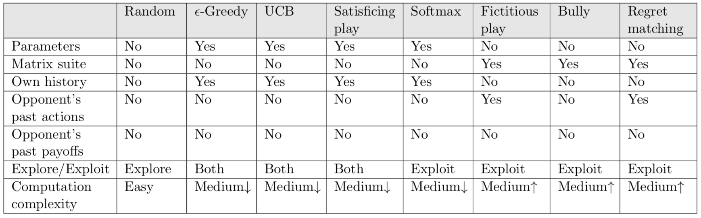
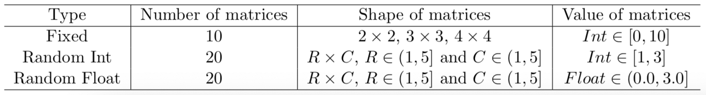
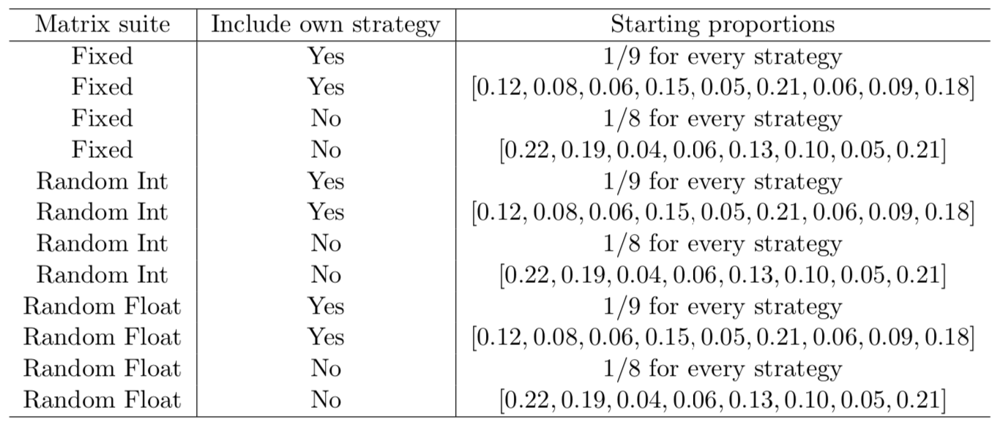
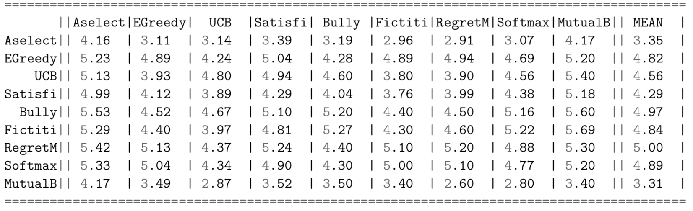
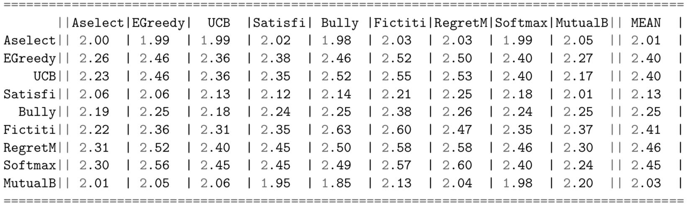
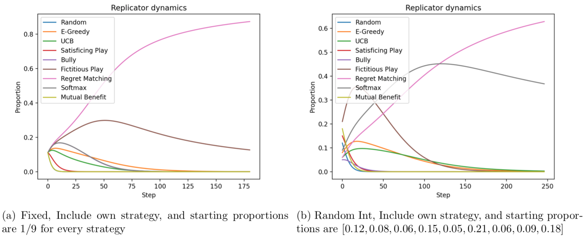
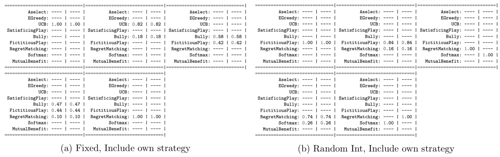

# Multi-Agent Learning

## Code

The code comes into the following six parts:
* Strategies: Different algorithms are defined in Strategies, which (1) decide the next action to take; (2) update the internal state after the payo↵ is received.
* Matrix Suite: Different games are defined in Matrix Suite, which are represented as payoff matrices.
* Game: Two players play against each other in Game, in which they take action and receive payoff based on
Matrix Suite. It is for one game.
* Grand Table: All the games are played between all the pairs of players for the specified number of rounds and restarts. It is for all the games, and it counteracts the randomness of games. The mean average payoff of all the algorithms for the row player are recorded in the grand table.
* Replicator Dynamic: Proportions of all the algorithms are calculated over the evolution and it will be visualized by a evolution graph.
* Nash: Nash equilibria will be generated by the tool Gambit.

## Algorithms

	

## Matrix suites

	

## Grand tables

There are in total 12 grand tables generated by di↵erent parameters, which are shown as following:

	

"Fixed, Include own strategy" is used to produce the following grand table:

	

"Random Int, Include own strategy" is used to produce the following grand table:

	

## Replicator dynamic graphs

2 of the 12 replicator dynamic graphs are shown as following:

	

## Nash equilibria

2 of the 12 Nash equilibria are shown as following:

	

